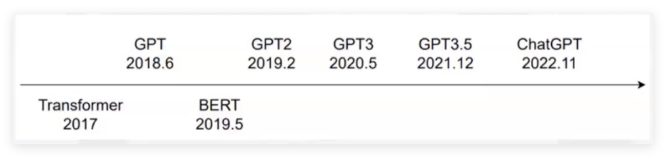
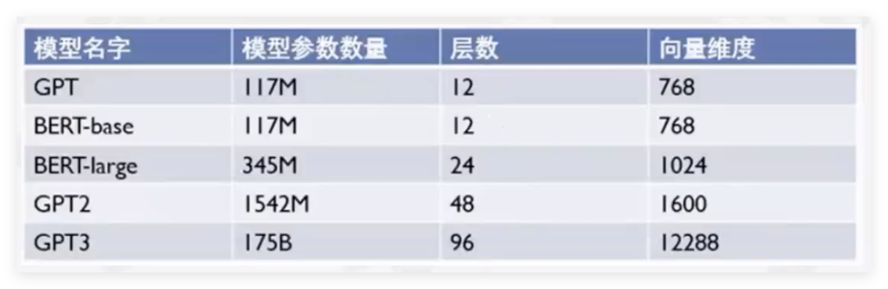
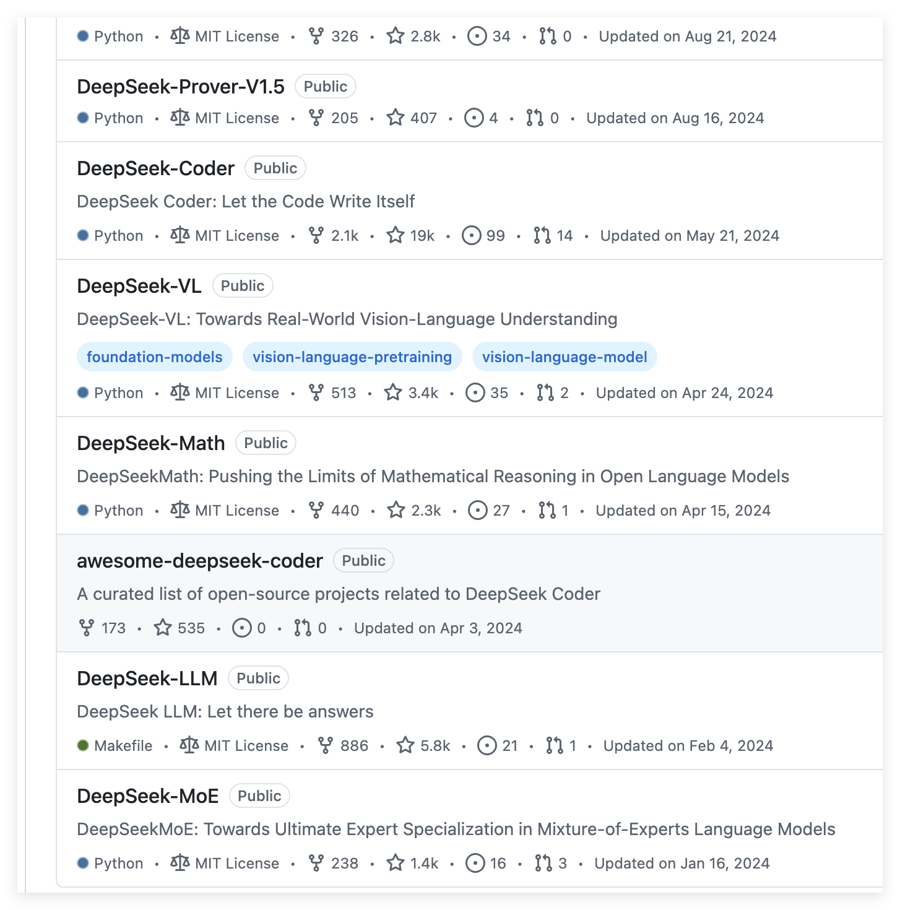

@[toc]
> 现阶段的LLM类似一部字典，可以回答问题，但是不能理解问题，不能推理，不能解决问题。DeepSeek-R1是一个新的LLM，可以推理，可以解决问题。
DeepSeek-R1是一个RLLLM，是一个强化学习的LLM。DeepSeek-R1是一个新的LLM，是一个新的时代。

```java
微软CEO萨蒂亚·纳德拉（Satya Nadella）周三在瑞士达沃斯举行的世界经济论坛上表示：“看到DeepSeek的新模型，无论是他们如何真正有效地完成了一个开
源模型来进行推理时间计算，还是计算效率方面，都令人印象深刻。我们应该非常认真地对待这一发展。”
DeepSeek-R1 模型下载：
DeepSeek-R1-Zero：https://huggingface.co/deepseek-ai/DeepSeek-R1-Zero
DeepSeek-R1：https://huggingface.co/deepseek-ai/DeepSeek-R1
DeepSeek-R1-Zero 和 DeepSeek-R1 基于DeepSeek-V3-Base 进行训练。

DeepSeek-R1-Distill 模型下载：
DeepSeek-R1-Distill-Qwen-1.5B：https://huggingface.co/deepseek-ai/DeepSeek-R1-Distill-Qwen-1.5B
DeepSeek-R1-Distill-Qwen-7B：https://huggingface.co/deepseek-ai/DeepSeek-R1-Distill-Qwen-7B
DeepSeek-R1-Distill-Qwen-14B：https://huggingface.co/deepseek-ai/DeepSeek-R1-Distill-Qwen-14B
DeepSeek-R1-Distill-Qwen-32B：https://huggingface.co/deepseek-ai/DeepSeek-R1-Distill-Qwen-32B

download from modelscope
https://modelscope.cn/models/deepseek-ai/DeepSeek-R1/summary
```

Professional skill


GPT： Generative Pre-trained Transformer



> Q: Which of the following AI models are trained without supervised fine-tuning (SFT)?   
A. DeepSeek-R1.  
B. DeepSeek-R1-Zero.  
C. AlphaGo.  
D. AlphaGo Zero.  
E. ChatGPT.  
F. LLaMa.  
G. Qwen. 

可以从这里购买GPU算力：https://www.autodl.com

> 【DeepSeek论文精读】7. 总结：DeepSeek 的发展历程与关键技术
https://blog.csdn.net/youcans/article/details/143723178

Brief analysis of DeepSeek R1 and its implications for Generative AI
  -- The author is from the Turing Institute
https://arxiv.org/html/2502.02523v3

Deepseek papers collection by Hugging Face
https://huggingface.co/collections/Presidentlin/deepseek-papers-674c536aa6acddd9bc98c2ac

DeepSeek-V3 Technical Report
https://arxiv.org/html/2412.19437v1


> DeepSeek LLM: Scaling Open-Source Language Models with Longtermism
https://arxiv.org/abs/2401.02954
https://github.com/deepseek-ai/DeepSeek-LLM

> DeepSeek-R1 Paper Explained – A New RL LLMs Era in AI?
https://aipapersacademy.com/deepseek-r1/

> Levels of AGI for Operationalizing Progress on the Path to AGI
https://arxiv.org/pdf/2311.02462

> How Far Are We From AGI: Are LLMs All We Need?
https://arxiv.org/abs/2405.10313

DeepSeek-Prover-V1.5: Harnessing Proof Assistant Feedback for Reinforcement Learning and Monte-Carlo Tree Search
https://arxiv.org/abs/2408.08152
https://github.com/deepseek-ai/DeepSeek-Prover-V1.5

DeepSeek-V2: A Strong, Economical, and Efficient Mixture-of-Experts Language Model
https://arxiv.org/abs/2405.04434

DeepSeek-V3 Technical Report
https://arxiv.org/abs/2412.19437

DeepSeek-R1: Incentivizing Reasoning Capability in LLMs via Reinforcement Learning
https://arxiv.org/abs/2501.12948

> https://github.com/deepseek-ai



> // todo: 
AlphaGo vs AlphaGo Zero paper in Nature.  
open-r1 by huggingface.  