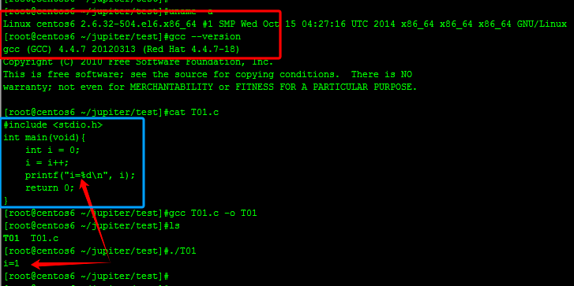
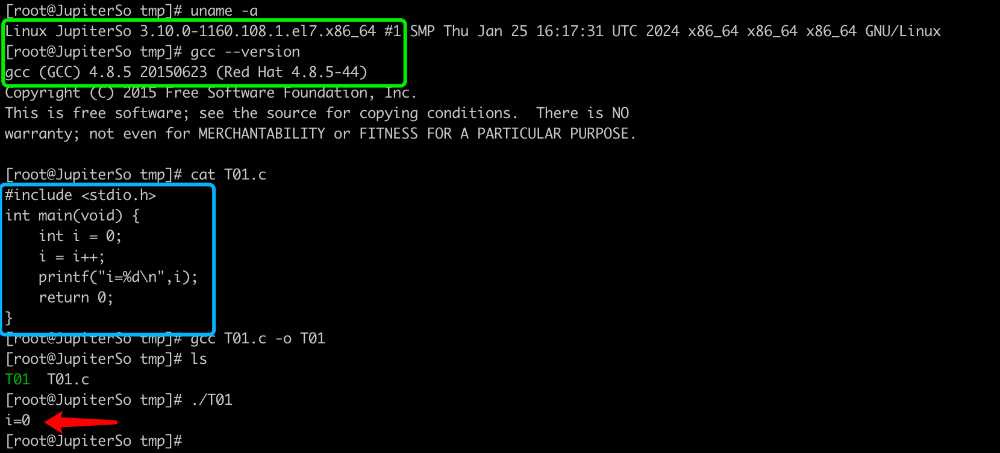

# Inspect IPP

## 1. What is the resulting value of i?
```java
int testMethod() {
    int i = 0;
    i = i++; // i=(i++) is the same
    // What is the resulting value of i ??
    // print i = ??
}
```

## 2.The Result
### 插入表格
| c  version 4.4.7                                                 | c version 4.8.5 |
|------------------------------------------------------------------|-----|
| {: style="width:300px; height:200px;"}    | {: style="width:300px; height:200px;"} |
|  | 2. 1 |
| 2. 1                                                             | 3. 2 |