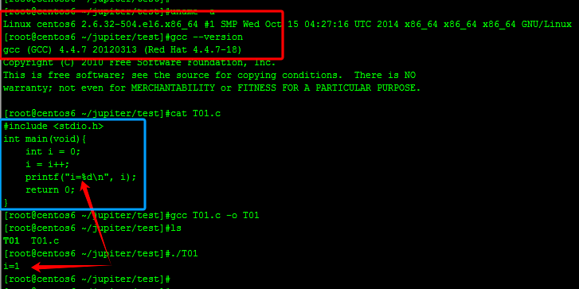
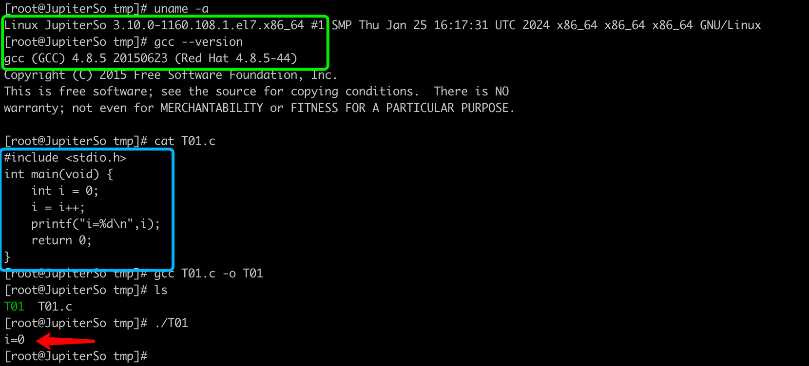
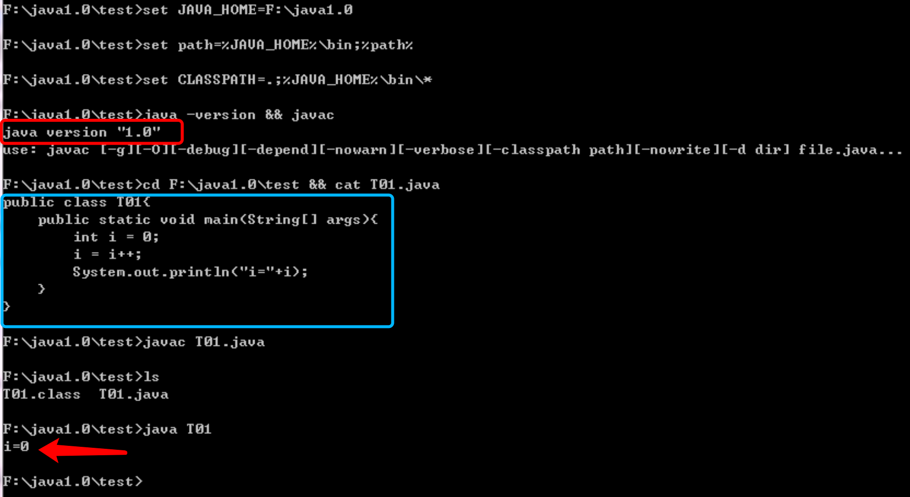
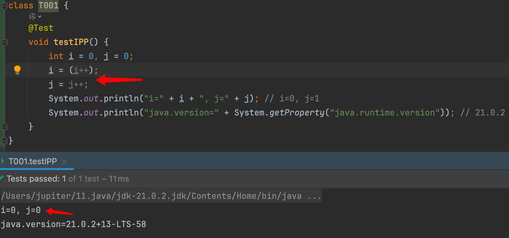
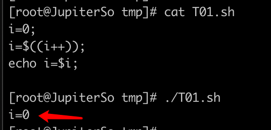
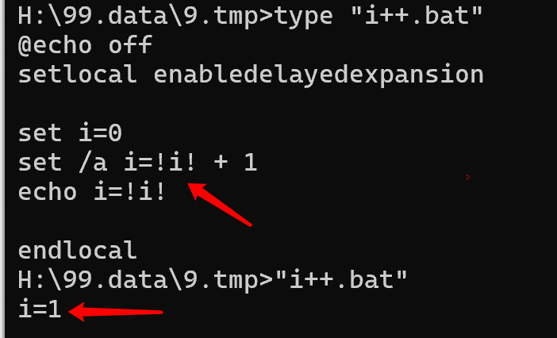
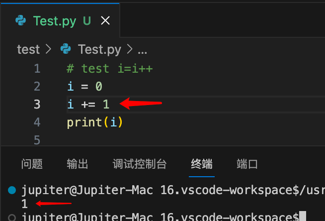
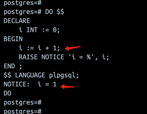

# Inspect IPP

## 1. What is the resulting value of i?
```java
int testMethod() {
    int i = 0;
    i = i++; // i=(i++) is the same
    // What is the resulting value of i ??
    // print i = ??
}
```

## 2. The Result
| c  version 4.4.7                                                          | c version 4.8.5                                                         |
|---------------------------------------------------------------------------|-------------------------------------------------------------------------|
|    |  |
| java version 1.0                                                          | java version 21                                                         |
|  |  |
| shell script                                                              | windows bat                                                             |
|                        |                        |
| python version 3                                                          | postgresql pl/pgsql                                                     |
|                           |                         |

## 3. Decompiled
### 3.1 c
<table>
  <tr valign="top">
    <td>
      Source Code
    </td>
    <td>
      Assembly Source Code
    </td>
  </tr>
  <tr valign="top">
    <td>
      <pre><code class="language-c">[root@centos6 ~/Jupiter/c]#cat T01.c
#include <stdio.h>
int main(void) {
    int i = 0;
    i = i++;
    printf("i=%d\n",i);
    return 0;
}

[root@centos6 ~/Jupiter/c]#gcc T01.c -o T01

[root@centos6 ~/Jupiter/c]#./T01
i=1
</code></pre>
    </td>
    <td>
      <pre><code class="language-c">[root@centos6 ~/Jupiter/c]#gcc -S T01.c
[root@centos6 ~/Jupiter/c]#cat T01.s
.file    "T01.c"
.section    .rodata
.LC0:
.string    "i=%d\n"
.text
.globl main
.type    main, @function
main:
.LFB0:
.cfi_startproc
pushq    %rbp
.cfi_def_cfa_offset 16
.cfi_offset 6, -16
movq    %rsp, %rbp
.cfi_def_cfa_register 6
subq    $16, %rsp
movl    $0, -4(%rbp)
addl    $1, -4(%rbp)
movl    $.LC0, %eax
movl    -4(%rbp), %edx
movl    %edx, %esi
movq    %rax, %rdi
movl    $0, %eax
call    printf
movl    $0, %eax
leave
.cfi_def_cfa 7, 8
ret
.cfi_endproc
.LFE0:
.size    main, .-main
.ident    "GCC: (GNU) 4.4.7 20120313 (Red Hat 4.4.7-11)"
.section    .note.GNU-stack,"",@progbits
</code></pre>
    </td>
  </tr>
</table>

### 3.2 java    (i=i++) vs (i++)
<table>
  <tr valign="top">
    <td>
      Source Code
    </td>
    <td>
      Source Code
    </td>
  </tr>
  <tr valign="top">
    <td>
      <pre><code class="language-java">[root@centos6 ~/Jupiter/c]#cat > T01.java
public class T01 {
    public static void main(String[] args){
        int i = 0;
        i = i++;  //==== look here =====
        System.out.println("i="+i);
    }
}
^C
[root@centos6 ~/Jupiter/c]#javac T01.java
[root@centos6 ~/Jupiter/c]#java T01
i=0
</code>
</pre>
</td>
<td>
<pre><code class="language-java">[root@centos6 ~/Jupiter/c]#cat > T02.java
public class T02 {
    public static void main(String[] args){
        int i = 0;
        i++;  //==== look here =====
        System.out.println("i="+i);
    }
}
^C
[root@centos6 ~/Jupiter/c]#javac T02.java
[root@centos6 ~/Jupiter/c]#java T02
i=1
</code></pre>
</td>
  </tr>
 <tr valign="top">
    <td>
      <pre><code class="language-java">[root@centos6 ~/Jupiter/c]#javap -c T01  
Compiled from "T01.java"
public class T01 {
  public T01();
    Code:
       0: aload_0
       1: invokespecial #1                  // Method java/lang/Object."<init>":()V
       4: return

public static void main(java.lang.String[]);
Code:
0: iconst_0 // 0入栈
1: istore_1 // 0出栈，赋给i
2: iload_1 // 将变量i的值(0)压栈，准备操作
3: iinc 1, 1 // i自增，完成此步后，i=1，但是，栈顶仍为第2步的值(0)
6: istore_1 // 栈顶的值(0)出栈并赋给i，i再次变成0
7: getstatic #2 // Field java/lang/System.out:Ljava/io/PrintStream;
10: new #3 // class java/lang/StringBuilder
13: dup
14: invokespecial #4 // Method java/lang/StringBuilder."<init>":()V
17: ldc #5 // String i=
19: invokevirtual #6 // Method java/lang/StringBuilder.append:(Ljava/lang/String;)Ljava/lang/StringBuilder;
22: iload_1
23: invokevirtual #7 // Method java/lang/StringBuilder.append:(I)Ljava/lang/StringBuilder;
26: invokevirtual #8 // Method java/lang/StringBuilder.toString:()Ljava/lang/String;
29: invokevirtual #9 // Method java/io/PrintStream.println:(Ljava/lang/String;)V
32: return
}
</code></pre>
</td>
<td>
<pre><code class="language-java">[root@centos6 ~/Jupiter/c]#javap -c T02
Compiled from "T02.java"
public class T02 {
  public T02();
    Code:
       0: aload_0
       1: invokespecial #1                  // Method java/lang/Object."<init>":()V
       4: return

public static void main(java.lang.String[]);
Code:
0: iconst_0
1: istore_1 // 以上完成i=0;

2: iinc 1, 1

5: getstatic #2 // Field java/lang/System.out:Ljava/io/PrintStream;
8: new #3 // class java/lang/StringBuilder
11: dup
12: invokespecial #4 // Method java/lang/StringBuilder."<init>":()V
15: ldc #5 // String i=
17: invokevirtual #6 // Method java/lang/StringBuilder.append:(Ljava/lang/String;)Ljava/lang/StringBuilder;
20: iload_1
21: invokevirtual #7 // Method java/lang/StringBuilder.append:(I)Ljava/lang/StringBuilder;
24: invokevirtual #8 // Method java/lang/StringBuilder.toString:()Ljava/lang/String;
27: invokevirtual #9 // Method java/io/PrintStream.println:(Ljava/lang/String;)V
30: return
}
</code></pre>
</td>
  </tr>
</table>

## 4. References
### 4.1 c language on ubuntu
```c
## run on ubuntu
root@hcss-ecs-1d9e:~/Jupiter# cat T01.c 
#include <stdio.h>
int main(void) {
    int i = 0;
    i = i++;
    printf("i=%d\n",i);
    return 0;
}
root@hcss-ecs-1d9e:~/Jupiter# uname -a
Linux hcss-ecs-1d9e 5.15.0-76-generic #83-Ubuntu SMP Thu Jun 15 19:16:32 UTC 2023 x86_64 x86_64 x86_64 GNU/Linux
root@hcss-ecs-1d9e:~/Jupiter# gcc --version
gcc (Ubuntu 11.3.0-1ubuntu1~22.04.1) 11.3.0
Copyright (C) 2021 Free Software Foundation, Inc.
This is free software; see the source for copying conditions.  There is NO
warranty; not even for MERCHANTABILITY or FITNESS FOR A PARTICULAR PURPOSE.
root@hcss-ecs-1d9e:~/Jupiter# gcc T01.c -o T01  #compile to ./T01
root@hcss-ecs-1d9e:~/Jupiter# ls
T01  T01.c
root@hcss-ecs-1d9e:~/Jupiter# ./T01 
i=0
root@hcss-ecs-1d9e:~/Jupiter#
```
### 4.2 java language
```java
[root@centos6 ~/Jupiter/c]#cat > T01.java
public class T01 {
    public static void main(String[] args){
        int i = 0;
        i = i++;
        System.out.println("i="+i);
    }
}
^C
[root@centos6 ~/Jupiter/c]#javac T01.java
[root@centos6 ~/Jupiter/c]#java T01
i=0
```
```java
[root@centos6 ~/Jupiter/c]#javap -c T01  
Compiled from "T01.java"
public class T01 {
  public T01();
    Code:
       0: aload_0
       1: invokespecial #1                  // Method java/lang/Object."<init>":()V
       4: return

  public static void main(java.lang.String[]);
    Code:
       0: iconst_0                          // 0入栈
       1: istore_1                          // 0出栈，赋给i       
2: iload_1                           // 将变量i的值(0)压栈，准备操作
       3: iinc          1, 1                // i自增，完成此步后，i=1，但是，栈顶仍为第2步的值(0)
       6: istore_1                          // 栈顶的值(0)出栈并赋给i，i再次变成0
       7: getstatic     #2                  // Field java/lang/System.out:Ljava/io/PrintStream;
      10: new           #3                  // class java/lang/StringBuilder
      13: dup
      14: invokespecial #4                  // Method java/lang/StringBuilder."<init>":()V
      17: ldc           #5                  // String i=
      19: invokevirtual #6                  // Method java/lang/StringBuilder.append:(Ljava/lang/String;)Ljava/lang/StringBuilder;
      22: iload_1
      23: invokevirtual #7                  // Method java/lang/StringBuilder.append:(I)Ljava/lang/StringBuilder;
      26: invokevirtual #8                  // Method java/lang/StringBuilder.toString:()Ljava/lang/String;
      29: invokevirtual #9                  // Method java/io/PrintStream.println:(Ljava/lang/String;)V
      32: return
}
```
```java
[root@centos6 ~/Jupiter/c]#cat > T02.java
public class T02 {
    public static void main(String[] args){
        int i = 0;
        i++;
        System.out.println("i="+i);
    }
}
^C
[root@centos6 ~/Jupiter/c]#javac T02.java
[root@centos6 ~/Jupiter/c]#java T02
i=1
```
```java
[root@centos6 ~/Jupiter/c]#javap -c T02
Compiled from "T02.java"
public class T02 {
  public T02();
    Code:
       0: aload_0
       1: invokespecial #1                  // Method java/lang/Object."<init>":()V
       4: return


  public static void main(java.lang.String[]);
    Code:
       0: iconst_0
       1: istore_1                          // 以上完成i=0;
       2: iinc          1, 1
       5: getstatic     #2                  // Field java/lang/System.out:Ljava/io/PrintStream;
       8: new           #3                  // class java/lang/StringBuilder
      11: dup
      12: invokespecial #4                  // Method java/lang/StringBuilder."<init>":()V
      15: ldc           #5                  // String i=
      17: invokevirtual #6                  // Method java/lang/StringBuilder.append:(Ljava/lang/String;)Ljava/lang/StringBuilder;
      20: iload_1
      21: invokevirtual #7                  // Method java/lang/StringBuilder.append:(I)Ljava/lang/StringBuilder;
      24: invokevirtual #8                  // Method java/lang/StringBuilder.toString:()Ljava/lang/String;
      27: invokevirtual #9                  // Method java/io/PrintStream.println:(Ljava/lang/String;)V
      30: return
}
```