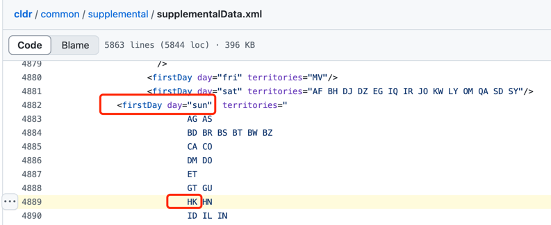
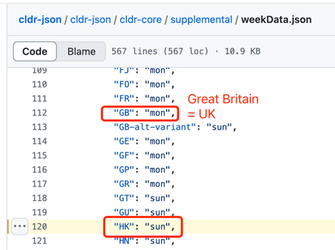
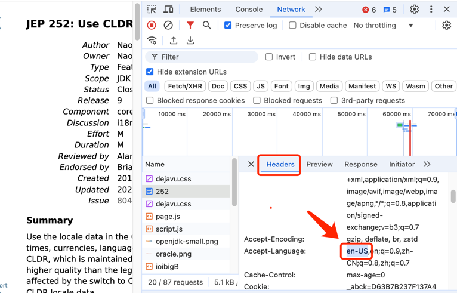
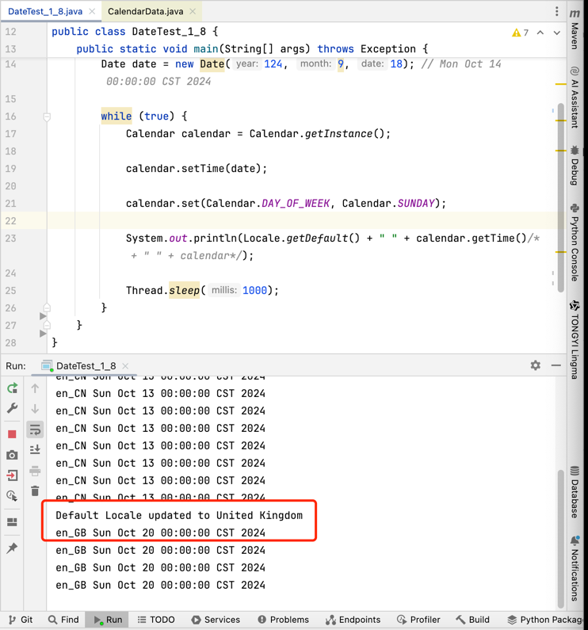
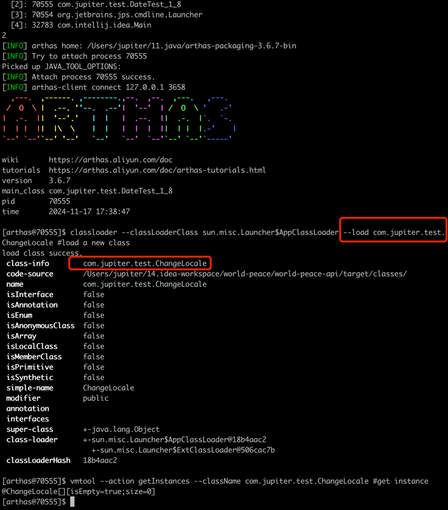
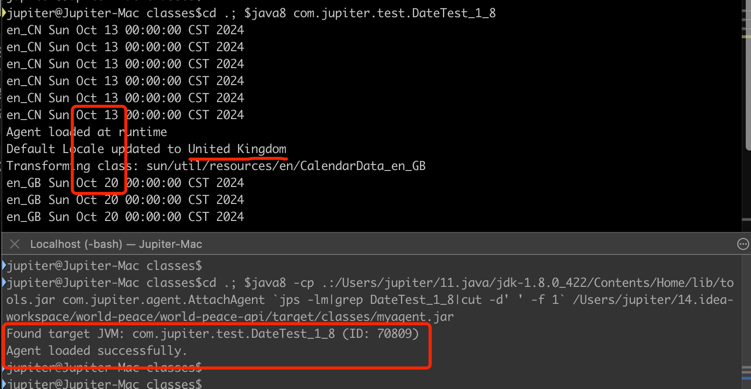

## Question:  
```java
What might Java use for the "first day of week" by default?
A: Monday
B: Sunday
C: Friday
D: Saturday
E: Depending on the "First day of week" setting in the operating system
```
Answer:  

## The First day of the week
1. **ISO 8601**:
   - The International Organization for Standardization (ISO) standard ***ISO 8601*** specifies that ***Monday*** is 
  the first day of the week. This standard is widely adopted in many countries, especially in Europe.
   - java 8 开始支持ISO 8601标准，通过[WeekFields.ISO.getFirstDayOfWeek()](https://docs.oracle.com/javase/8/docs/api/java/time/temporal/WeekFields.html#fields)得到Monday. 
2. **CLDR (Common Locale Data Repository)**:
   - [What is CLDR? ](https://cldr.unicode.org/)
   - In CLDR the First day of the week is ***Sunday*** [for HongKong](https://www.unicode.org/cldr/charts/42/supplemental/territory_information.html#HK), and ***Monday*** for the [United Kingdom](https://www.unicode.org/cldr/charts/42/supplemental/territory_information.html#GB).
   - Before [version 41.0](https://www.unicode.org/cldr/charts/41/supplemental/territory_information.html#CN) the First day of the week is ***Sunday*** for China (CN), and it changed[(CLDR-11510)](https://unicode-org.atlassian.net/browse/CLDR-11510) to ***Monday*** in [version 42.0](https://www.unicode.org/cldr/charts/42/supplemental/territory_information.html#CN).
   - Latest XML: [CLDR_weekData.xml](https://github.com/unicode-org/cldr/blob/main/common/supplemental/supplementalData.xml#L4889)
   - Latest Json: [CLDR_weekData.json](https://github.com/unicode-org/cldr-json/blob/main/cldr-json/cldr-core/supplemental/weekData.json#L120)
3. **Java And CLDR**:
   - JDK 8 was the first Java release to contain CLDR locale data as well as the legacy locale data from the 1990s, though it used the legacy data by default. [JEP 252](https://openjdk.org/jeps/252)
```java
// jdk 8 (legacy data), in rt.jar
// sun.util.resources.uk.CalendarData_uk
    { "firstDayOfWeek", "2" },
    { "minimalDaysInFirstWeek", "1" }
// sun.util.resources.cldr.ar.CalendarData_ar_KW
   final Object[][] data = new Object[][] {
           { "firstDayOfWeek", "7" },
           { "minimalDaysInFirstWeek", "1" },
   };

// jdk 11 
// sun.util.resources.cldr.CalendarData
{ "firstDayOfWeek", "1: ... CN ... HK ...;2: 001 AD AI AL ... GB ...;6: MV;7: AE AF BH DJ DZ EG IQ IR JO KW LY MA OM QA SD SY" },
```
   - JDK 9, [by default, will give priority to the CLDR provider at run time](https://openjdk.org/jeps/252)，并且可以通过以下参数来选择区域数据源的优先级‌。  
     - -Djava.locale.providers=CLDR,JRE,COMPAT ... COMPAT can be used as a synonym for JRE
   - Java 20 [Supports for CLDR Version 42.0](https://bugs.openjdk.org/browse/JDK-8284840), in [this CLDR version](https://www.unicode.org/cldr/charts/42/supplemental/territory_information.html#CN), [Fix first day of week info for China (CN)](https://unicode-org.atlassian.net/browse/CLDR-11510) from ***Sunday*** to ***Monday***.
   - Java 23: The legacy locale data will no longer include in the JDK.
   - For CN, the first day of the week is ***Sunday*** in java 11, and ***Monday*** in java 21. Match the CLDR data.
   - 
   -  | 

## How the First day of the week uses in Java
1. [**java.util.Calendar**](https://docs.oracle.com/javase/8/docs/api/java/util/Calendar.html):  
   - [***Source Code***](https://github.com/openjdk/jdk8u/blob/master/jdk/src/share/classes/java/util/Calendar.java#L159) and [***Docs***](https://docs.oracle.com/javase/8/docs/api/java/util/Calendar.html)
```java
// The Calendar class provides methods for converting between a specific instant in time and a set of calendar fields 
// such as YEAR, MONTH, DAY_OF_MONTH, HOUR, and so on.

// The calendar field values for the currently set time for this calendar. This is an array of FIELD_COUNT integers, 
// with index values ERA through DST_OFFSET.
protected int[] fields; // It contains the value for YEAR, MONTH, DAY_OF_MONTH ... 

// The currently set time for this calendar, expressed in milliseconds after January 1, 1970, 0:00:00 GMT.
protected long time;

// fields and time may be inconsistent, which may cause unexpected results, such as:
set(DAY_OF_WEEK, sunday); // set current day to Sunday

// fields and time will be synchronized after calling:
setTime();
getTime();

/* If there is any conflict in calendar field values, Calendar gives priorities to calendar fields that have been set 
more recently. The following are the default combinations of the calendar fields. The most recent combination, as 
determined by the most recently set single field, will be used.
For the date fields:

YEAR + MONTH + DAY_OF_MONTH
YEAR + MONTH + WEEK_OF_MONTH + DAY_OF_WEEK
YEAR + MONTH + DAY_OF_WEEK_IN_MONTH + DAY_OF_WEEK
YEAR + DAY_OF_YEAR
YEAR + DAY_OF_WEEK + WEEK_OF_YEAR

// We look for the most recent of the fields in each group to determine
// the age of the group.  For groups involving a week-related field such
// as WEEK_OF_MONTH, DAY_OF_WEEK_IN_MONTH, or WEEK_OF_YEAR, both the
// week-related field and the DAY_OF_WEEK must be set for the group as a
// whole to be considered.  (See bug 4153860 - liu 7/24/98.)
*/
```
2. [**java.time.temporal.WeekFields**](https://docs.oracle.com/javase/8/docs/api/java/time/temporal/WeekFields.html#fields)
```java
/*
A week is defined by:
The first day-of-week. For example, the ISO-8601 standard considers Monday to be the first day-of-week.
The minimal number of days in the first week. For example, the ISO-8601 standard counts the first week as needing at least 4 days.
Together these two values allow a year or month to be divided into weeks.
 */
```

## [Locale](https://docs.oracle.com/javase/8/docs/api/java/util/Locale.html)
   - Locale.getDefault() retrieves the default locale of the JVM, that is determined by the JVM at startup and is typically based on the operating system's settings. It can represent the user's ***language, country***, and variant.
   - You can change the default locale for the JVM using  **Locale.setDefault(Locale newLocale)** . However, this change affects only the current JVM instance and does not persist across sessions.

## The unexpected date issue
1. **Normal process**
```java
          Locale from OS at startup
                    |
                    |
                 (region) (and cache in memory)
                    ↓
JVM ----------------+-------------------> First day of week ---> Calendar.getInstance() ---> setTime() & set() to Sunday ---> getTime() --> normal date
                    ↑
      (JRE legacy data/CLDR data)
                    |
                    |
           LocaleServiceProvider
```
2. **How does the calendar change to unexpected?**
```java
public class DateTest_1_8 {
   public static void main(String[] args) throws Exception {
      // sleep 5秒后将本地化信息Locale设置为GB - United Kingdom (Great Britain)
        new Thread(() -> {
            try {Thread.sleep(3000);} catch (Exception e) {}
            Locale.setDefault(Locale.UK);
        }).start();

      Date date = new Date(124, 9, 18); // Mon Oct 18 00:00:00 CST 2024

      while (true) {
         Calendar calendar = Calendar.getInstance();
         calendar.setTime(date);
         calendar.set(Calendar.DAY_OF_WEEK, Calendar.SUNDAY); // 这一行违反了JDK的规范，但在这个case里不影响结果(JDK-4655637)
         System.out.println(Locale.getDefault() + " " + calendar.getTime()/* + " " + calendar*/);
         Thread.sleep(1000);
      }
   }
}
/* output
... ...
en_CN Sun Oct 13 00:00:00 CST 2024
en_GB Sun Oct 20 00:00:00 CST 2024
... ...
 */
// Summary: The region changes while application is running, it causes the calendar to change to unexpected.
```
```java
          Locale from OS at startup
                    |
                    |
                 (region) (and cache in memory)  <====== sth changes the region, may impact to First day of week
                    ↓
JVM ----------------+-------------------> First day of week ---> Calendar.getInstance() ---> setTime() & set() to Sunday ---> getTime() --> the unexpected date
                    ↑
      (JRE legacy data/CLDR data)
                    |
                    |
           LocaleServiceProvider
```
3. **Cause by the JVM parameters.**
```java
java -Duser.language=en -Duser.country=CN xxx.jar // or JAVA_TOOL_OPTIONS

//View the JDK/JRE default display language Settings: 
java -XshowSettings:locale -version 
   Locale settings:
   default locale = English (China)
   default display locale = English (China)
   default format locale = English (China)
```

4. **Cause by the Java Web Container.**
```java
// Spring framework:
// session scope:
org.springframework.web.servlet.i18n.LocaleChangeInterceptor
org.springframework.boot.autoconfigure.web.WebProperties.LocaleResolver
```


5. **Cause by the external factors (e.g. Java Agent).**
```java
// This is an external class, which is not belong to our application.
public class ChangeLocale {
    static {
        Locale.setDefault(Locale.UK); // update the locale
        System.out.println("Default Locale updated to United Kingdom");
    }
}
```
| Application (DateTest_1_8)                                                          | External Application (ChangeLocale)                                                 |
|-------------------------------------------------------------------------------------|-------------------------------------------------------------------------------------|
|  |  |
  -   


## Lesson learned
1. The Class Calendar is a poorly designed API, suggest to use the java.time package in java 8 instead.
2. Pay attention to Java major version upgrade to avoid data behavior change.
3. Understand clearly underlying data structure and its principle with the API, such as Calendar, BigDecimal, etc.

## References
***[java.lang.instrument](https://docs.oracle.com/javase/8/docs/api/java/lang/instrument/package-summary.html)***
  - Java Instrumentation API provides a mechanism for monitoring and modifying the behavior of Java applications at runtime.
  - Provides services that allow Java programming language agents to instrument programs running on the JVM. The mechanism for instrumentation is modification of the byte-codes of methods.

***[Java Agent](https://docs.oracle.com/en/java/javase/11/docs/api/jdk.attach/com/sun/tools/attach/VirtualMachine.html)***
   - Java Agents are powerful tools for modifying and monitoring Java applications at runtime, providing flexibility for developers to enhance application behavior without altering the original source code.

***Calendar相关的bug:***  
https://bugs.java.com/bugdatabase/view_bug.do?bug_id=4655637 // Calendar.set() for DAY_OF_WEEK does not return the right value.  
https://bugs.java.com/bugdatabase/view_bug.do?bug_id=4685354 // Handling of Calendar fields setting state is broken.  
https://bugs.java.com/bugdatabase/view_bug?bug_id=4860664 // REGRESSION:Calendar get(Calendar.DAY_OF_WEEK)invalid under certain circumstances.  
https://bugs.java.com/bugdatabase/view_bug?bug_id=4727451 // GregorianCalendar constructors set invalid setting state for ERA.  
https://bugs.java.com/bugdatabase/view_bug.do?bug_id=4633646 // Setting WEEK_OF_MONTH to 1 results in incorrect date.  
https://bugs.java.com/bugdatabase/view_bug.do?bug_id=4153860 // SimpleDateFormat fails to parse redundant data.  
