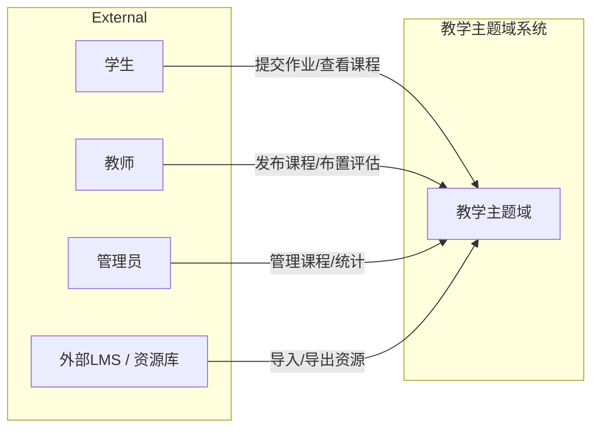
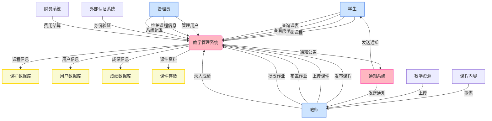

```mermaid
flowchart LR
  subgraph External
    Student[学生]
    Teacher[教师]
    Admin[管理员]
    LMS[外部LMS / 资源库]
  end

  subgraph System[教学主题域系统]
    A[教学主题域]
  end

  Student -->|提交作业/查看课程| A
  Teacher -->|发布课程/布置评估| A
  Admin -->|管理课程/统计| A
  LMS -->|导入/导出资源| A
```

```mermaid
graph TD
    A[学生] -->|注册课程| B(教学管理系统)
    A -->|提交作业| B
    A -->|查看成绩| B
    A -->|查询课表| B
    
    C[教师] -->|发布课程| B
    C -->|上传课件| B
    C -->|布置作业| B
    C -->|批改作业| B
    C -->|录入成绩| B
    
    D[管理员] -->|管理用户| B
    D -->|维护课程信息| B
    D -->|系统配置| B
    
    B -->|课程信息| E[课程数据库]
    B -->|用户信息| F[用户数据库]
    B -->|成绩信息| G[成绩数据库]
    B -->|课件资料| H[课件存储]
    
    I[课程内容] -->|提供| C
    J[教学资源] -->|上传| C
    
    B -->|通知公告| K[通知系统]
    K -->|发送通知| A
    K -->|发送通知| C
    
    L[外部认证系统] -->|身份验证| B
    M[财务系统] -->|费用结算| B
    
    style A fill:#cde4ff,stroke:#6495ED,stroke-width:2px
    style C fill:#cde4ff,stroke:#6495ED,stroke-width:2px
    style D fill:#cde4ff,stroke:#6495ED,stroke-width:2px
    style B fill:#ffb6c1,stroke:#ff69b4,stroke-width:2px
    style E fill:#fafad2,stroke:#ffd700,stroke-width:2px
    style F fill:#fafad2,stroke:#ffd700,stroke-width:2px
    style G fill:#fafad2,stroke:#ffd700,stroke-width:2px
    style H fill:#fafad2,stroke:#ffd700,stroke-width:2px
    style K fill:#ffb6c1,stroke:#ff69b4,stroke-width:2px

```